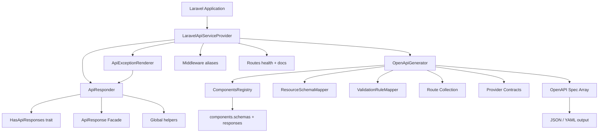
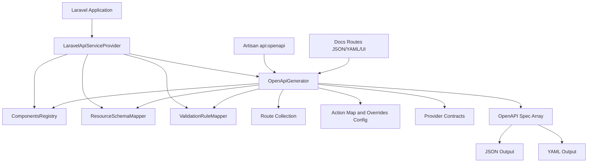

# Architecture

## Purpose

`yoosuf/laravel-api` is a full-stack Laravel API toolkit providing: consistent response envelopes, structured error formats, OpenAPI 3 spec generation, request correlation, API versioning, exception rendering, paginator adapters, ETag helpers, security headers, deprecation signaling, and a built-in health endpoint.

## Design goals

- Framework-native integration with the Laravel service container and routing.
- Predictable, configurable response shapes with zero boilerplate in controllers.
- Enterprise-ready request traceability (correlation IDs, versioning, deprecation).
- Strong extension model through contracts and config-driven behaviour.
- Clean separation between the response surface, the OpenAPI surface, and infrastructure middleware.

## High-level architecture



## Core components

### LaravelApiServiceProvider

File: `src/LaravelApiServiceProvider.php`

- Registers all singletons: `ApiResponder`, `OpenApiGenerator`, `ApiExceptionRenderer`, support classes.
- Registers five named middleware aliases (`force-json`, `request-id`, `security-headers`, `versioning`, `deprecation`).
- Optionally auto-registers `ApiExceptionRenderer` when `exceptions.auto_render` is true.
- Loads routes when either `openapi.docs_route.enabled` OR `health.enabled` is true.
- Publishes config, views, and assets.

### ApiResponder

File: `src/Http/ApiResponder.php`

The central response factory. All config is read lazily (no constructor pre-load), so config changes in tests take effect immediately.

Key capabilities:
- Every standard HTTP status code covered (200–503).
- Two error formats: `envelope` and `structured`.
- `paginated()` with OData-lite body and RFC 5988 `Link` header.
- `fromPaginator()` / `fromCursorPaginator()` adapters.
- `Location` header on `created()` and `accepted()`.
- `Retry-After` + `X-RateLimit-*` headers on 429 / 503.
- ETag generation (`withEtag()`), conditional-request check (`checkEtag()`), `notModified()`.
- `structuredError()` for explicit RFC-style errors.

### HasApiResponses

File: `src/Concerns/HasApiResponses.php`

Trait that exposes every `ApiResponder` method as a `protected` controller shortcut. Import it into any controller to eliminate `app(ApiResponder::class)->...` calls.

### Middleware

Files: `src/Http/Middleware/`

| Alias | Class | Purpose |
|---|---|---|
| `laravel-api.force-json` | `ForceJsonMiddleware` | Forces `Accept: application/json` |
| `laravel-api.request-id` | `RequestIdMiddleware` | `X-Request-ID` / `X-Correlation-ID` |
| `laravel-api.security-headers` | `SecurityHeadersMiddleware` | Security response headers |
| `laravel-api.versioning` | `ApiVersionMiddleware` | Validates `api-version` |
| `laravel-api.deprecation` | `DeprecationMiddleware` | `Deprecation:` / `Sunset:` headers |

### ApiExceptionRenderer

File: `src/Exceptions/ApiExceptionRenderer.php`

Converts framework exceptions (`AuthenticationException`, `AuthorizationException`, `ValidationException`, `ModelNotFoundException`, `HttpException`, `Throwable`) to consistent JSON API responses. Only activates for requests that expect JSON or hit `api/*` routes. Register via `ApiExceptionRenderer::register()` or set `exceptions.auto_render = true`.

### OpenApiGenerator

File: `src/OpenApi/OpenApiGenerator.php`

- Enumerates routes, applies prefix / include / exclude / middleware filters.
- Infers tags from controller class name.
- Detects auth middleware and adds `security: [{ bearerAuth: [] }]`.
- Adds standard response references (401, 403, 404, 422, 429, 500) per operation.
- Merges `action_map`, route/action overrides, and provider-supplied fragments.
- Injects `requestBody` from `FormRequest` rules.
- Injects response schemas from `JsonResource` / `ResourceCollection` return types.

### ComponentsRegistry

File: `src/OpenApi/Support/ComponentsRegistry.php`

- Merges schemas from config, providers, and inference.
- Always emits `ErrorEnvelope` and `StructuredError` schemas.
- Always emits six standard `responses` entries (Unauthenticated, Forbidden, NotFound, ValidationError, TooManyRequests, ServerError).

### ApiResponseAssertions

File: `src/Testing/ApiResponseAssertions.php`

Trait for test cases. Provides fluent assertion methods (`assertApiSuccess`, `assertApiPaginated`, `assertStructuredError`, `assertApiTooManyRequests`, etc.).

## Request / response flow

```
HTTP Request
    │
    ├─ ForceJsonMiddleware        → sets Accept: application/json
    ├─ RequestIdMiddleware        → attaches X-Request-ID on req + resp
    ├─ SecurityHeadersMiddleware  → appends security response headers
    ├─ ApiVersionMiddleware       → validates api-version, stores on attributes
    │
    ├─ Route dispatch
    │       │
    │       └─ Controller (HasApiResponses)
    │               │
    │               └─ ApiResponder → JsonResponse
    │
    ├─ Exception thrown?
    │       └─ ApiExceptionRenderer → consistent JsonResponse
    │
    └─ HTTP Response (with X-Request-ID, X-Correlation-ID, Retry-After, ETag, etc.)
```

## Configuration model

Root key: `laravel-api`

Key groups:

| Group | Purpose |
|---|---|
| `openapi.*` | spec metadata, output paths, filters, cache, UI, providers, overrides |
| `response.*` | error format, envelope keys, default messages, pagination keys |
| `request_id.*` | header names, enable toggle |
| `versioning.*` | enable, query param, header, supported list |
| `exceptions.*` | auto_render toggle |
| `health.*` | enable, route path, middleware |

## Architectural constraints

- Internal class structure may evolve in minor releases.
- Public contracts, command signatures, config keys, and response shapes are SemVer-governed.
- Inference is best-effort and safe-defaults-first; use `action_map` / `overrides` for precise control.


## Design goals

- Framework-native integration with Laravel service container and routing.
- Predictable OpenAPI output from route metadata plus optional inference.
- Strong extension model through contracts and config-driven behavior.
- Clear separation between public API surface and internal implementation.

## High-level architecture



## Core components

### Service provider

File: src/LaravelApiServiceProvider.php

Responsibilities:

- Registers singleton services used in generation and inference.
- Publishes config, docs assets, and views.
- Registers Artisan command and runtime docs routes.

### OpenApiGenerator

File: src/OpenApi/OpenApiGenerator.php

Responsibilities:

- Enumerates routes and generates path operations.
- Applies include/exclude and middleware filters.
- Merges action_map and manual overrides.
- Integrates resource and validation inference.
- Produces final OpenAPI object and serializes JSON/YAML.

### ComponentsRegistry

File: src/OpenApi/Support/ComponentsRegistry.php

Responsibilities:

- Aggregates component schemas from config and providers.
- Guarantees referenced schemas exist in components.schemas.
- Outputs normalized components payload.

### Inference mappers

Files:

- src/OpenApi/Support/ResourceSchemaMapper.php
- src/OpenApi/Support/ValidationRuleMapper.php

Responsibilities:

- Infer response schema fragments from JsonResource and ResourceCollection.
- Infer request body schema fragments from FormRequest rules.

### Extensibility contracts

Files:

- src/OpenApi/Contracts/SchemaProvider.php
- src/OpenApi/Contracts/OperationOverrideProvider.php

Responsibilities:

- Allow application-specific schema and operation augmentation.

## Runtime flow

1. Package service provider is booted.
2. Consumer runs api:openapi or requests docs routes.
3. Generator loads routes and applies filters.
4. Generator builds operations and merges:
   - inferred fragments
   - action map entries
   - route/action overrides
5. Components registry finalizes schemas.
6. Spec is returned or written as JSON/YAML.

## Configuration model

Root key: laravel-api.openapi

Key groups:

- metadata and server info
- output paths
- docs routes and docs_ui
- filters
- providers
- action_map
- overrides
- components.schemas

## Architectural constraints

- Internal class structure may evolve in minor releases.
- Public contracts, command signature, and config schema are SemVer-governed.
- Inference is best-effort and designed for safe defaults over strict schema precision.

## Operational characteristics

- Generation is synchronous and route-count dependent.
- No external services are required for core generation.
- UI rendering depends on CDN-hosted Swagger UI or Redoc scripts by default.
