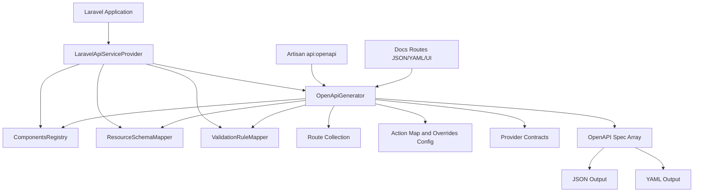

# Architecture

## Purpose

yoosuf/laravel-api provides route-driven OpenAPI generation, optional runtime docs endpoints, and extensibility points for schema and operation customization.

## Design goals

- Framework-native integration with Laravel service container and routing.
- Predictable OpenAPI output from route metadata plus optional inference.
- Strong extension model through contracts and config-driven behavior.
- Clear separation between public API surface and internal implementation.

## High-level architecture

## Core components

### Service provider

File: src/LaravelApiServiceProvider.php

Responsibilities:

- Registers singleton services used in generation and inference.
- Publishes config, docs assets, and views.
- Registers Artisan command and runtime docs routes.

### OpenApiGenerator

File: src/OpenApi/OpenApiGenerator.php

Responsibilities:

- Enumerates routes and generates path operations.
- Applies include/exclude and middleware filters.
- Merges action_map and manual overrides.
- Integrates resource and validation inference.
- Produces final OpenAPI object and serializes JSON/YAML.

### ComponentsRegistry

File: src/OpenApi/Support/ComponentsRegistry.php

Responsibilities:

- Aggregates component schemas from config and providers.
- Guarantees referenced schemas exist in components.schemas.
- Outputs normalized components payload.

### Inference mappers

Files:

- src/OpenApi/Support/ResourceSchemaMapper.php
- src/OpenApi/Support/ValidationRuleMapper.php

Responsibilities:

- Infer response schema fragments from JsonResource and ResourceCollection.
- Infer request body schema fragments from FormRequest rules.

### Extensibility contracts

Files:

- src/OpenApi/Contracts/SchemaProvider.php
- src/OpenApi/Contracts/OperationOverrideProvider.php

Responsibilities:

- Allow application-specific schema and operation augmentation.

## Runtime flow

1. Package service provider is booted.
2. Consumer runs api:openapi or requests docs routes.
3. Generator loads routes and applies filters.
4. Generator builds operations and merges:
   - inferred fragments
   - action map entries
   - route/action overrides
5. Components registry finalizes schemas.
6. Spec is returned or written as JSON/YAML.

## Configuration model

Root key: laravel-api.openapi

Key groups:

- metadata and server info
- output paths
- docs routes and docs_ui
- filters
- providers
- action_map
- overrides
- components.schemas

## Architectural constraints

- Internal class structure may evolve in minor releases.
- Public contracts, command signature, and config schema are SemVer-governed.
- Inference is best-effort and designed for safe defaults over strict schema precision.

## Operational characteristics

- Generation is synchronous and route-count dependent.
- No external services are required for core generation.
- UI rendering depends on CDN-hosted Swagger UI or Redoc scripts by default.
